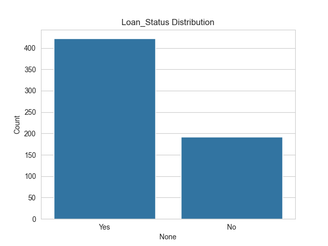
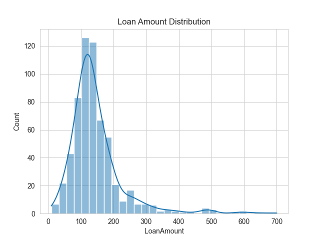
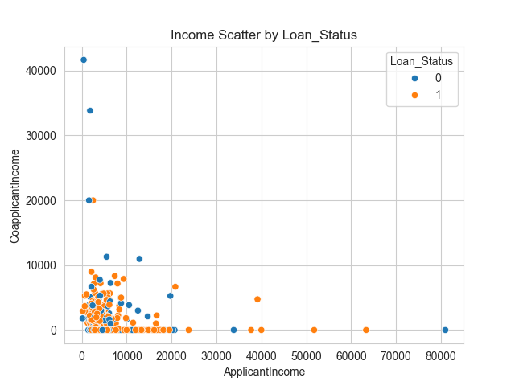
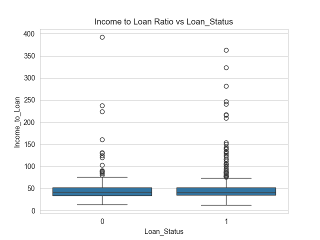
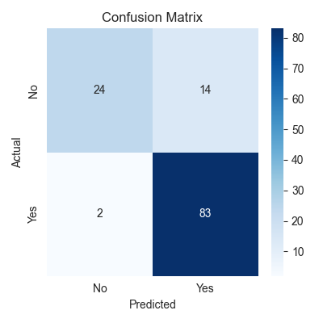

# Loan Prediction Model

A tuned RandomForest classifier (best params = `{'max_depth': 5, 'min_samples_split': 10, 'n_estimators': 50}`) plus basic feature engineering. Achieved **~86.99% accuracy** on validation.

## Plots

 

